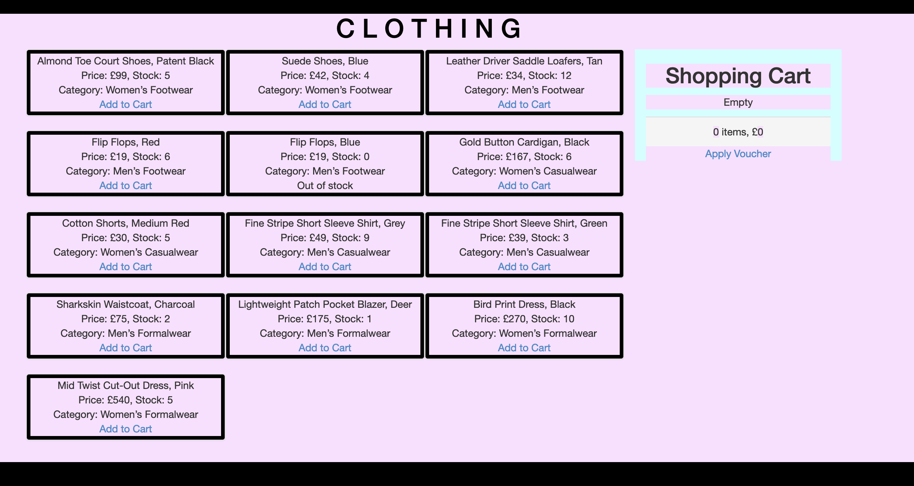
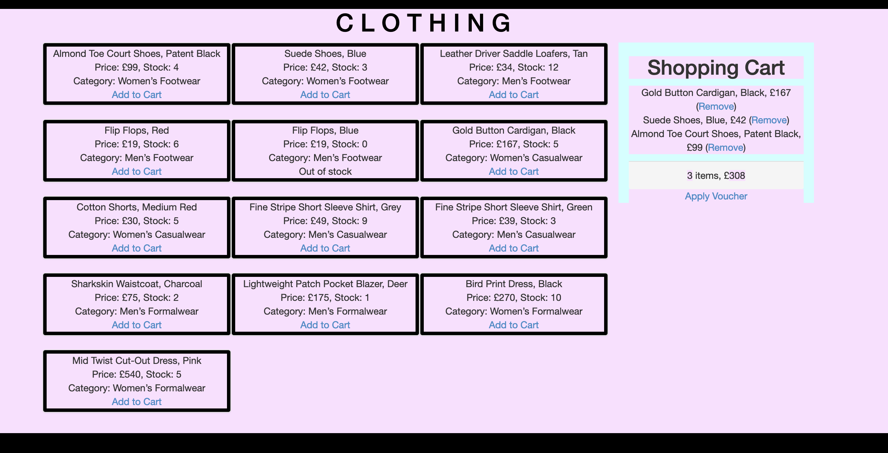

<h1 align="center">Responsive Website for a Clothing Retailer</h1>

This simple clothing website was built using Javascript, HTML and CSS. I was initially going to build it in Ruby on Rails, however, I decided that Javascript would be the most appropriate for the given task. I chose Javascript as it is a programming language that I enjoy and would like to improve on, and I therefore took the decision to challenge myself.  Throughout this challenge, I followed a strict process for problem solving and debugging. I enjoyed breaking down the problem and harnessing the power of Google!

## Getting Started

1. Clone this repository `git clone git@github.com:beacourage/clothing_store.git`
2. Change into directory `cd clothing_store`
4. Run the web app `open -a "Google Chrome" index.html`
5. Run tests with the testing framework Jasmine `open -a "Google Chrome" SpecRunner.html`

## Testing

* A strict Test Driven Development process was used throughout. I followed a strict red, green, refactor cycle throughout this challenge - writing one test followed by a minimum amount of code to make it pass, and subsequently refactoring. My stringent TDD process is demonstrated through my commit history whereby  each commit reflects one cycle of the red green refactor cycle. Each passing test is accompanied by a commit who’s message is both clear and concise.
* The testing framework used is Jasmine, and my program consists of 19 tests with all of the tests passing. Each test has a clear description and my code is thoroughly tested.  
* TDD approach - 'Red Green Refactor' loop.
* Bellow shows all the passing tests:


## Design

* My program consists of three separate classes that can be reasonably justified - Cart, IndividualProduct and Store. I have followed the Single Responsibility Principle whereby each class does more or less one thing. By initializing a new instance of the Cart class in my Store class, I was able to call Cart methods on any new instances of the store class.
* I ensured that none of my classes were coupled to their dependencies and in each class, the dependencies are passed in as arguments to the constructor. Having dependency injections allows my code to be reusable or tested independently, the code works totally by itself.
* In order to keep my code as clean and DRY as possible, I ensured that all methods where fewer than seven lines and all classes were fewer than fifty five lines.


## Prioritised User Stories

The user stories formed part of the development test criteria.

```
As a user,
So that I can see the items in the shop,
I can view the products and their category, price and availability information.

As a user,
So that I can buy an item of clothing,
I can add a product to my shopping cart.

As a user,
So that I can change my mind on an item of clothing,
I can remove a product from my shopping cart.

As a user,
So that I can see how much money,
I can view the total price for the products in my shopping cart.

As a user,
So I know if an item is available,
I can see the total quantity of each item.

As a user,
So that I can user my voucher,
I can apply a voucher to my shopping cart.

As a user,
So that I can see the final price,
I can view the total price for the products in my shopping cart with discounts applied.

As a user,
So that I know I'm using the correct voucher,
I am alerted when I apply an invalid voucher to my shopping cart.

As a user,
So that I only buy items that are in stock,
I am unable to put Out of Stock products in the shopping cart.
```

## Instructions for User

* Immediately after running the web app (open index.html), there will be a clothing website with an empty shopping cart:



* The product descriptions are in each of the boxes, and in order to add a product to the shopping cart, click the blue "Add to cart" link under the product description. Below shows three items added to the shopping cart. As shown, there is an option to remove each item from the shopping cart. Notice that adding an item to the shopping cart decreases its quantity and you are unable to add out of stock products to the cart. In addition, notice how the total price for products in the shopping cart is displayed at the bottom of the shopping cart.




## Challenges and Improvements

There were a couple of challenges associated with this test.
* The first challenge was deciding which technology to use. I started in Ruby on Rails, however, I realised that I would not be able to fully showcase my coding as Ruby on Rails does many things for you ! I then started again in Javascript, and in order to not waste time, I should have spent more time planning which technologies to use and why I would use them.
* Seven out of the nine user stories were completed, and I did not have time to apply discount vouchers that can be redeemed. I decided that in order for my website to feel 'complete', I would spend some time on the front end so that I could at least see a basic web application and it was not all back end. If I were to repeat this task, I would have focussed more heavily on the backend in order to complete  all of the user requirements. I would have created a new class called Voucher and included the logic for the specific discounts within this class. I would have then initialized a new instance of the Voucher class in the Cart class to then call Voucher methods on any new instances of the cart class.


## Technologies used

Tech | Description
------------- | -------------
[Javascript](https://www.javascript.com/) | Main language used
[Jasmine](https://jasmine.github.io) | Javascript testing framework
[HTML5](https://www.w3schools.com/html/default.asp) | Hypertext Markup Language
[CSS](https://www.w3schools.com/css/) | Cascading Style Sheets
[Bootstrap](http://getbootstrap.com) | Bootstrap Framework, for basic front end
[Trello](https://trello.com/) | Tracking and organising workflow
[Google](https://www.google.co.uk/) | Internet-related services and products

## Contributors

This app was built with contributions from myself:
* [Beatrice Courage](https://github.com/beacourage)
